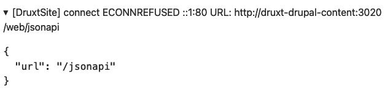

# Druxt and Druxt-site for Wordpress developers

> A druxt quickstart site with DDEV, (ejected from gitpod because reasons).

The original documentation and license is preserved below

[Original Druxt.js MIT license &rarr;](https://github.com/druxt/druxt.js/blob/develop/LICENSE)<br>
[Original Quickstart Druxt Site repo &rarr;](https://github.com/druxt/quickstart-druxt-site)<br>
[Local Druxt.js license &rarr;](https://github.com/miclgael/druxt-sandbox-next/blob/mg-tweaks/LICENSE-druxt)

---

## Table of Contents

- [Druxt and Druxt-site for Wordpress developers](#druxt-and-druxt-site-for-wordpress-developers)
  - [Table of Contents](#table-of-contents)
  - [💧 Background](#-background)
  - [📚 Notes](#-notes)
    - [1. Don't use MAMP/Pro (for now)](#1-dont-use-mamppro-for-now)
    - [2. `druxt-site` doesn't work with subfolders or obscure ports](#2-druxt-site-doesnt-work-with-subfolders-or-obscure-ports)

## 💧 Background

I am familiar with Nuxt, but I am not a Drupal developer. My background is with Wordpress, so learning Druxt for me comes with an additional learning curve. This repo is for my own self-directed learning.

My aim is to use this project to inform my approach in my work and where possible help to improve Druxt documentation.

Example components expect the `/jsonapi` endpoint to return content from Drupal's _Umami_ demo site.

## 📚 Notes

### 1. Don't use MAMP/Pro (for now)

Either use the 1-click Gitpod solution, or if you prefer to work locally, install Docker, and ddev and use those.

Remember to:

- Run `mkcert -install`
- Stop and shut-down MAMP
- Stop other containers running on port 80/443
  - Check for any apps running on ports with e.g. `lsof -nP -iTCP -sTCP:LISTEN | grep 443`

---

### 2. `druxt-site` doesn't work with subfolders or obscure ports

So, why not use MAMP Pro?

In my experience installing Drupal and setting a custom hostname, subfolder and port resulted in errors when running `npm run dev` - (either 404 and a crash or a ECONNREFUSED in the `<DruxtDebug />` component on the front-end).



This is not something I could resolve easily by searching, so I asked for help in the `#druxt-site` channel on the official Druxt discord server. [Permalink &rarr;](https://discord.com/channels/753866667590680587/849520152102043649/954666298212757534)

TL;DR - when attempting to [change ports from the defaults](https://ddev.readthedocs.io/en/stable/users/extend/config_yaml/#ddevconfigyaml-options) (in `.ddev/config.yaml`) - the `npm run dev` command will fail.

```
router_http_port: "80"
router_https_port: "443"
```

---
